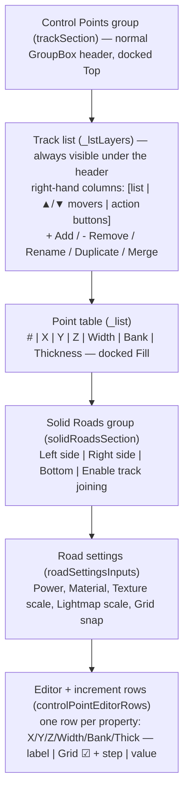

# Control Points — Layout Redesign (mirror Edge Features)

**Status:** Implemented (per the "better reference" screenshot)
**Applies to:** RoadGen side panel (`MainWindow.BuildSidePanel`)
**Goal:** Restructure the top of the side panel so the track editor mirrors the **Edge Features** layout pattern — a collapsible **"Track 1"** header hovering above the control points, with the increment controls as per-property rows and the actions at the bottom.

---

## 1. The reference layout (what we built)

Top → bottom, one merged **Track** group:

Then the side panel continues with a standalone **Optimization** group and the unchanged **Edge Features** group.

---

## 2. Key changes vs. the old layout

| Old | New |
|---|---|
| `Layers` group (track list + joining + actions) sat above a separate `Control Points` group. | Merged into one **Control Points** group with a normal group-box header; the track list sits at the top (always visible). |
| A collapsible `Track 1` header toggled the track list. | Removed — the section uses a normal header, the track list is always visible. |
| `Enable track joining` lived in the `Layers` group. | Moved into the **Solid Roads** row (`Left side / Right side / Bottom / Enable track joining`). |
| `+ Add / - Remove / Rename / Duplicate / Merge` sat under the track list (or at the bottom of the Track group). | Moved into a **vertical column on the right of the track list**, next to the ▲/▼ mover buttons (`layerActionColumn`). |
| Increment/Decrement interval was a separate horizontal grid below the editors. | **Inlined into each editor row** (X/Y/Z/Width/Bank/Thick): `label | Grid ☑ + step | value`, mirroring the Edge Features rows. |
| Optimization sat inside the Road Settings group. | Standalone group under Track (unchanged content). |

---

## 3. Implementation notes

- No new data/settings — pure re-parenting + dock-order change in `BuildSidePanel`.
- **Docking is in reverse z-order** (last control added docks first), so `trackSection` children are added in reverse of the desired layout: `solidRoadsSection` → `roadSettingsInputs` → `controlPointEditorRows` → `_list` → `trackListHost` → `_btnTrackHeader`. This puts the Solid Roads group directly below the point table.
- The track list host is laid out `[list | ▲/▼ movers | action buttons]`: `_lstLayers` fills, `layerMoverColumn` (right) and `layerActionColumn` (right, added last so it sits at the far right) stack beside it. The old bottom `trackActionRow` is gone.
- The section is a plain `GroupBox` (`trackSection`) — no collapsible header; the track list is always visible under the group title.
- Section titles were invisible (dark-on-dark), so the section `GroupBox`es set `ForeColor = Color.LightGray`; `StyleSectionInputTextColors()` then restores `SystemColors.WindowText` on the editor inputs so they stay readable on their white backgrounds (ForeColor is ambient/inherited).
- Editor + increment rows use the same helpers as Edge Features: `AddFeatureSettingRow` (label | increment cell | value) with `BuildFeatureIncrementCell` (Grid checkbox + step value, step hidden while following the grid). X/Y/Z/Width follow grid by default; Bank does not.
- `AddFeatureSettingRow` clamps numerics to `0..100000`, so the point-value editors restore their wider range afterward (`Minimum = -1000000` for X/Y/Z/Width/Bank, `Minimum = 0` for Thickness) so negative coordinates still work.
- `Thick` has **no increment cell** today (there is no thickness increment in the data model) — its row is just the value editor.
- Point table row `#` stays **0-indexed** (`0, 1, 2, …`) — unchanged.
- Removed now-unused helpers: `AddIncrementRow` (was only for the interim vertical increment rows) and `AddField` (was only for the old horizontal editor row). `AddIncrementColumn` is still unused and can be removed later.

---

## 4. Known gaps / follow-ups

1. **Thickness increment (added):** `Thick` now has its own `Grid` + step cell like the other rows, backed by new `IncUseGridThickness` / `IncCustomThickness` settings (track-file v9 + `Migrate8To9`). The editor value field is `_trackThickness`.
2. **Bank row** in the reference appears as `☐ Grid 4.00 0.00` (the step value shown next to the point value when not following the grid) — the current row shows both, which matches.

